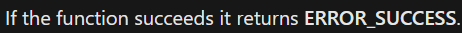

# Morse Typer
Have you ever wanted to convert keystrokes to morse code in real time? Probably not, but now you can! If you're on Windows... because this project completely unnecessarily relies on the Windows API in *three distinct ways*.

## Usage
```
 > morse
 
 -- OR --
 
 > morse <frequency> <interval>
 (no input handling, that's your problem)
```

## Why
I had to make use of the single documented function in the important sounding '[utilapiset.h](https://docs.microsoft.com/en-us/windows/win32/api/utilapiset/)', **Beep**. Yes the source is disgusting, no I will not refactor it.
This codebase follows the ways of the WinAPI.

<br />

